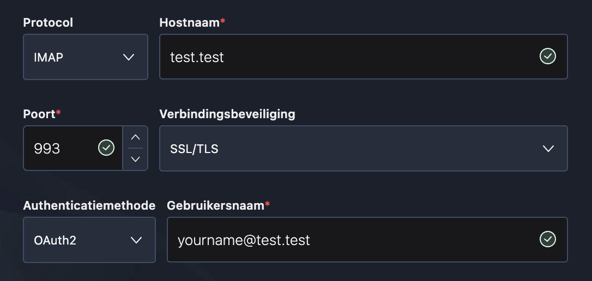
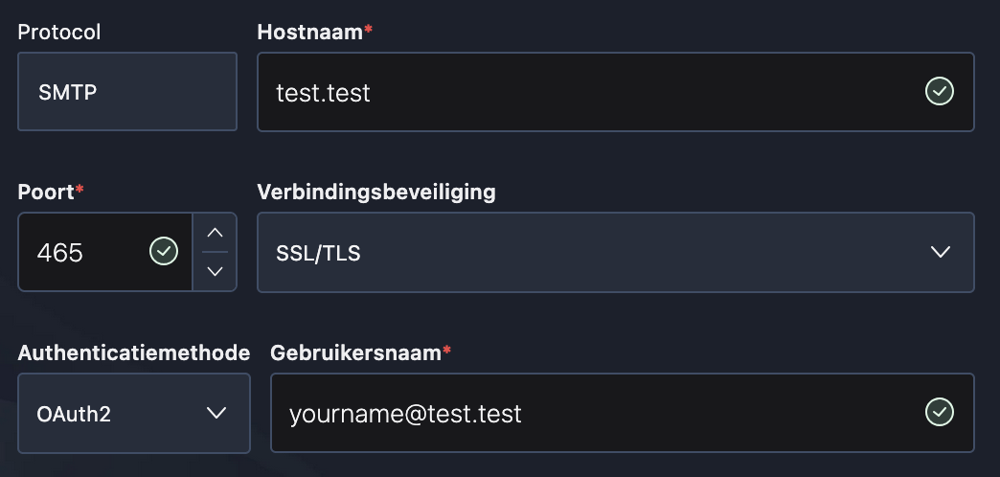
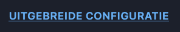
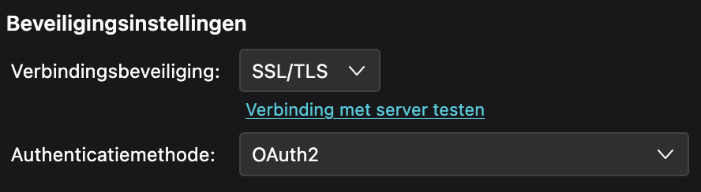
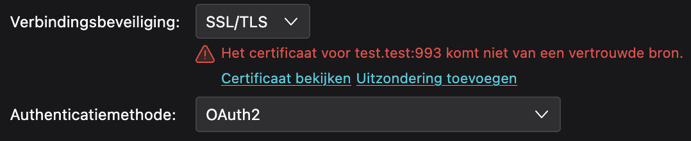
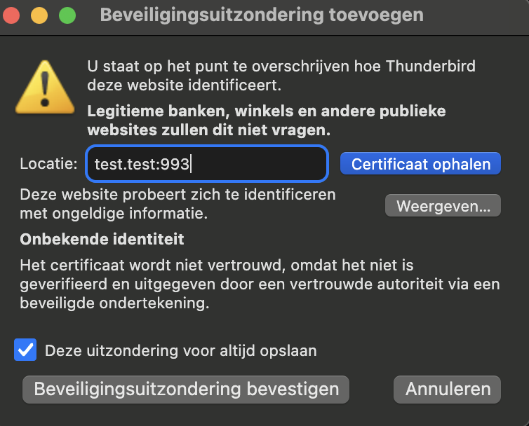
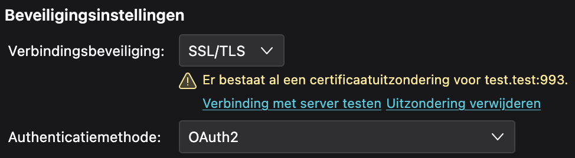

# How to use

### Step 1
You have to make a few changes to your `hosts` file. (Root required)

```
Windows: C:\Windows\System32\drivers\etc\hosts
```

```
Linux: /etc/hosts
```

```
MacOS: /etc/hosts
````

Add the following to your `hosts` file:

```bash
127.0.0.1 test.test
127.0.0.1 oauth.test.test
```

>Comment any already existing lines starting with 127.0.0.1 or localhost out.

### Step 2
Get your dependencies ready.

Create a virtual environment.
```bash
python3 -m venv venv
```

Enter the virtual environment.

Windows
```powershell
./venv/Scripts/activate
```

Linux / MacOS
```bash
source ./venv/bin/activate
```

Install the dependencies.

>Mind your current working directory. This command is meant to be run from the root of the entire project.

```bash
pip install -r docker/dns-oauth2/oauth-mfaportal-com/requirements.txt
```

### Step 3
Head over to `docker/dns-oauth2/oauth-mfaportal-com/`.

Start `IdP_Thunderbird` and `IdP_Dovecot`.

```bash
sudo python3 IdP_Thunderbird
```

```bash
sudo python3 IdP_Dovecot
```

To verify they have started correctly, you should see this for `IdP_Thunderbird`

```bash
 * Serving Flask app 'IdP_Thunderbird'
 * Debug mode: on
WARNING: This is a development server. Do not use it in a production deployment. Use a production WSGI server instead.
 * Running on https://127.0.0.1:443
Press CTRL+C to quit
 * Restarting with stat
 * Debugger is active!
 * Debugger PIN: 138-905-501
```

and this for `IdP_Dovecot`:

```bash
 * Serving Flask app 'IdP_Dovecot'
 * Debug mode: on
WARNING: This is a development server. Do not use it in a production deployment. Use a production WSGI server instead.
 * Running on http://127.0.0.1:80
Press CTRL+C to quit
 * Restarting with stat
 * Debugger is active!
 * Debugger PIN: 138-905-501
 ```

>Be sure to check that `IdP_Thunderbird` runs on port `443` and `IdP_Dovecot` runs on port `80`.

You are all set now.

# How to login to a Dovecot server using Thunderbird

### Step 1
Start Dovecot in docker using this command:

>Make sure you are in the correct directory
> `docker/dns-oauth2/mailserver/`

```bash
docker compose up
```

### Step 2
Open Thunderbird and add a new account.

Do the following, enter your name (does not matter what you enter), and enter your email.

email: `your_name@test.test` (anything before the @ may be changed.)

Press `continue`

---

A window opens where you can enter your password (does not matter what you enter). And next the mfa procedure will start.

Complete it and the window will close.

---

Now the following screen will pop-up. 

>Make sure that you copy the exact settings as the picture below. (Except for your email, use the one you entered at the `add account` window).

#### Inbound traffic


Press `continue`

---

Now another screen will pop-up.

>Here again, copy the exact settings as the picture below. (Except for your email, use the one you entered at the `add account` window).


#### Outbound traffic


Now instead of pressing continue, press this button, and click on `Ok`.



(Otherwise known as `extended configuration`)

### Step 3
Head over to the `Account Settings` page, and go to the `Server Settings` page.

Here you might need to add an exception for the self-signed certificate of the Dovecot server.



Press `Verbinding met server testen` (or `Test connection to server`).

You will now see this error:


Press on `Uitzondering toevoegen` (or `Add exception`).

Now This window will open. Press on the bottom left button: `Beveiligingsuitzondering bevestigen` (or `Accept security-exception`).



If you see this, you are ready to go.



If you see some red text, then open the security tab again and it should change to the image you see above this message.

### Step 4

At this point you can open your `inbox` and check the bottom left for the status messages. You should also see your `trash` appear below your inbox if everything worked as it should.

>You might need to sign in again and provide another mfa code, before you see your inbox and trash.